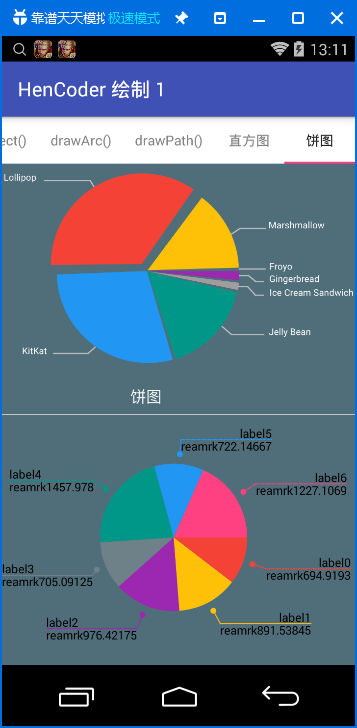

HenCoder 绘制 1 练习项目
===

### 这是什么？

这不是一个独立使用的项目，它是 [HenCoder Android 开发进阶：UI 1-1 绘制基础](http://hencoder.com/ui-1-1) 的配套练习项目。

### 我的效果如下：
当然，柱状图和饼图只是demo，结合了最近我们项目里要做的效果，之前项目里用的是mpandroidchart，后面打算再整理整理自己写的替换掉mpandroidchart。

柱状图：    饼图：
